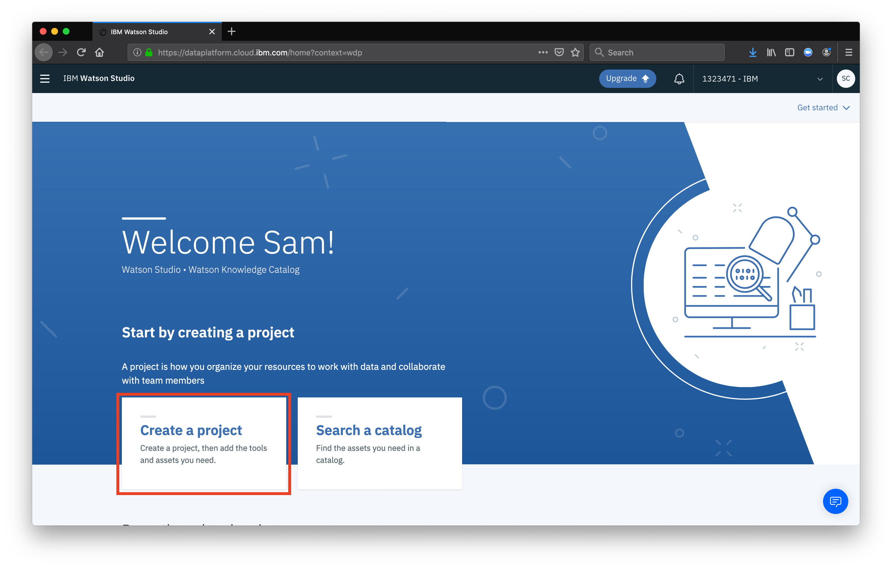
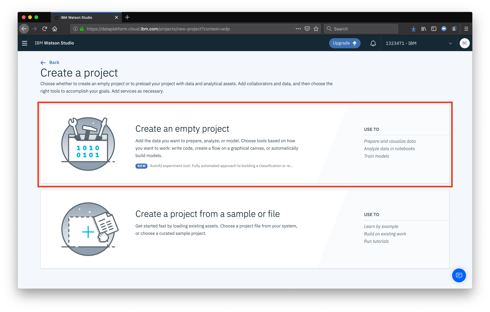
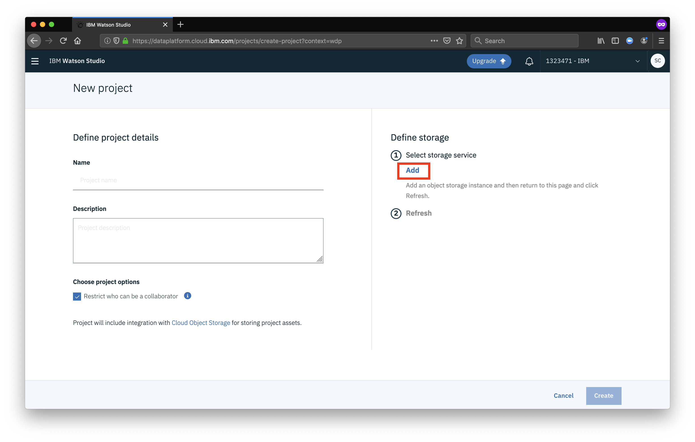
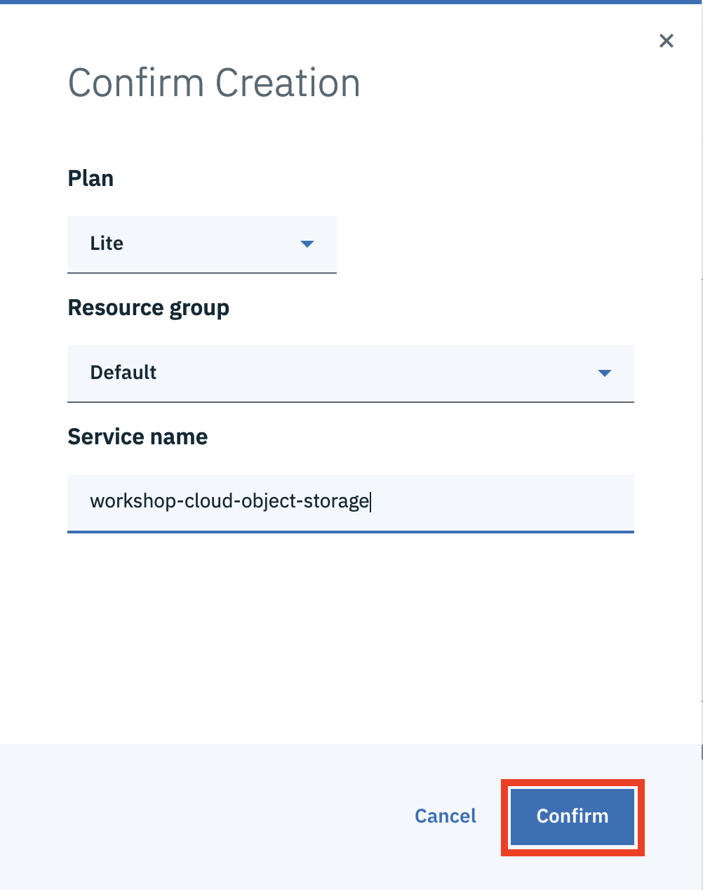

From the landing page of Watson Studio, select the option for **Create a project**

Now, select the option to create an **empty project**.

Give your project a name, and click the button **Add** to create an Object Storage instance for your project. If an object storage insance is already created, there will be a dropdown list to select from.

A new window will open to create you **Object Storage** instance. Select the **Lite** option for pricing plan (*Lite is the free tier available for most services*) and then click **Create**.

Finally, you can name your service and finish by clicking **Confirm**.

When your object storage instance if finished being created, you should click **Refresh** in the **New Project** window to see your new storage service as an option. Finish creating your new project by clicking **Create**.