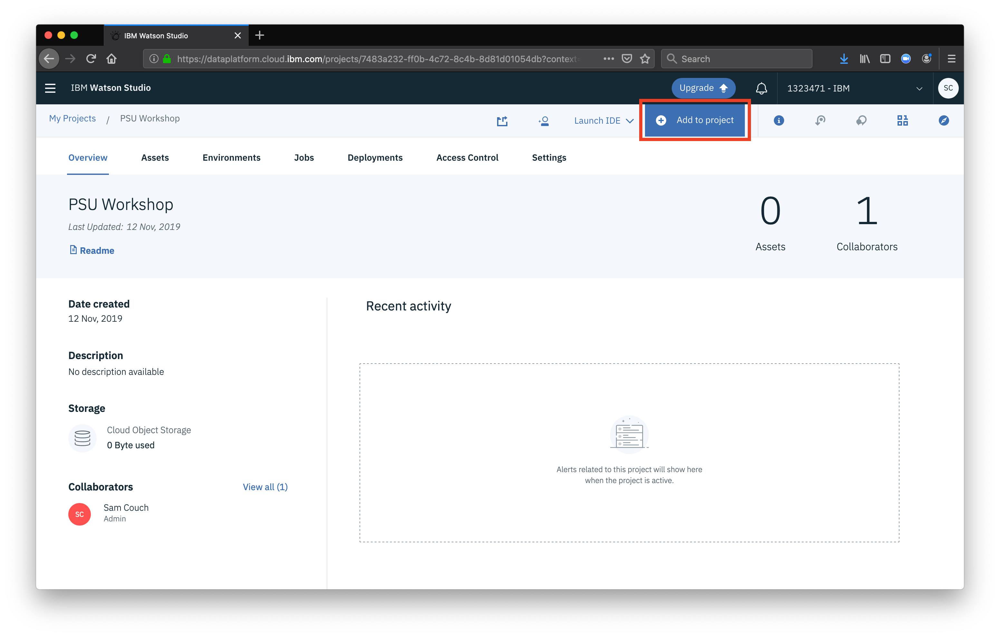
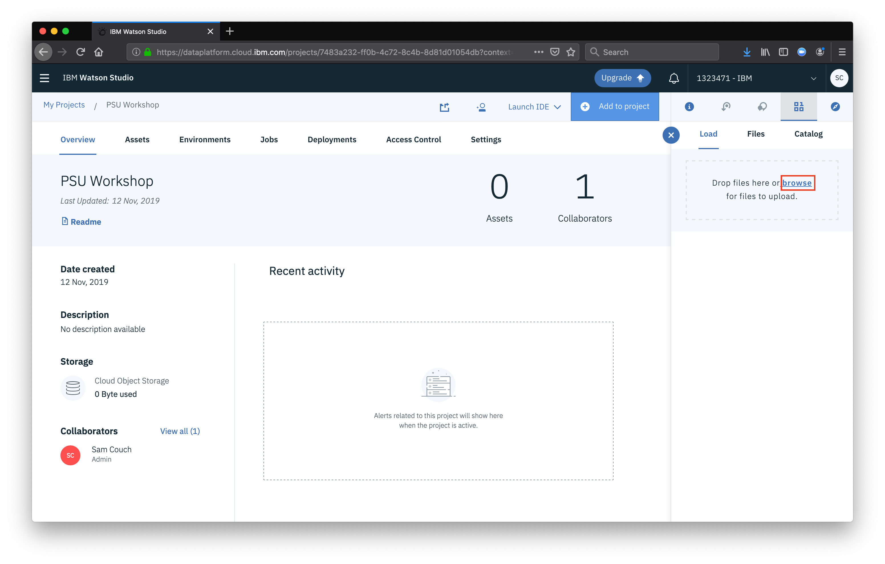
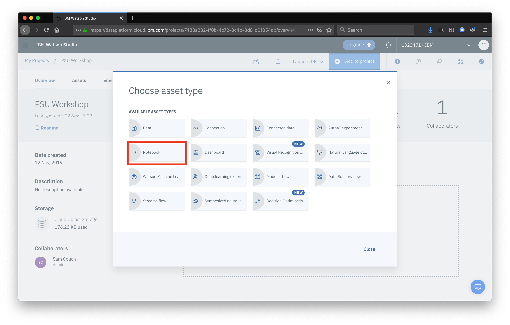
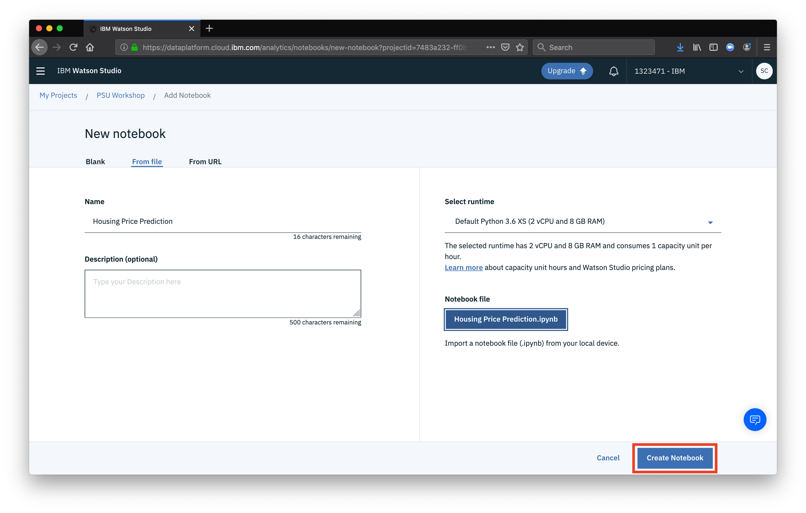

Now that our project is ready to go, let's set it up!

## Download porject files
For this workshop, some files have been made available to simplify things a bit. Download the zip archive [here](https://github.com/IBM/watson-studio-workshop/archive/master.zip) or simply run 

`git clone git@github.com:IBM/watson-studio-workshop.git`

Included are 2 folders:
* `data`: a single CSV file which will act as our primary data source
    * A collection of historic home sales with various columns to describe the conditions
* `notebooks`: a pre-built notebook to train and deploy our models

# Add the data
From your project dashboard, click **Add to project**

Then select the **Data** option

A sidebar will appear, select the **browse** option to navigate to the location of our project files, then the **data** directory, and finally the CSV file from above.

# Add the notebook
Once again, click **Add to project**

This time, select **Notebook**

Then select **from file** and click **choose file**

When prompted, navigate to the **notebooks** directory from the project files you downloaded, then select the `.ipynb` file. Finally, click **Create notebook**.

