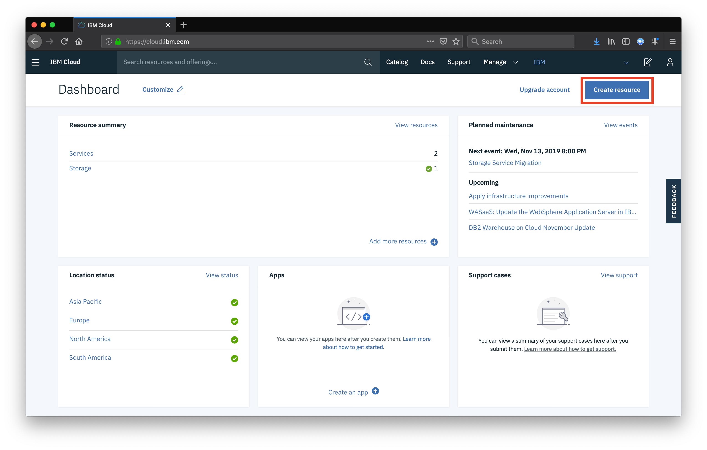
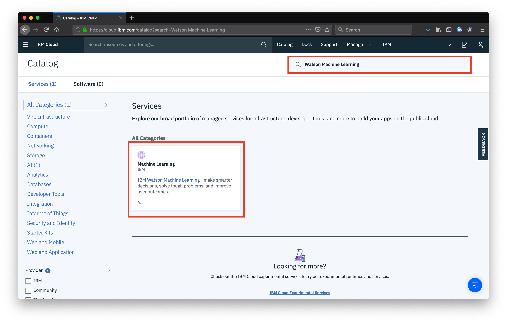
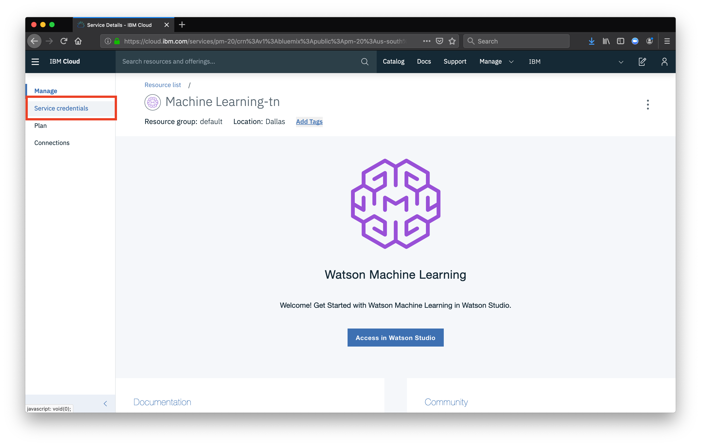
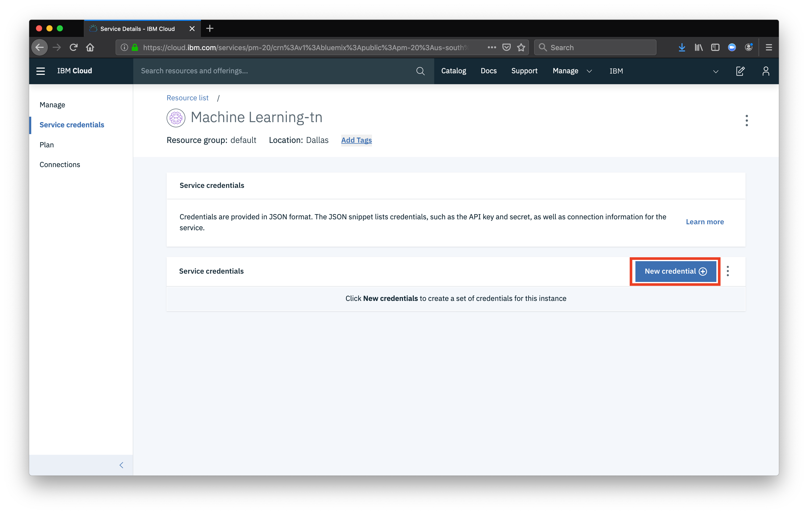
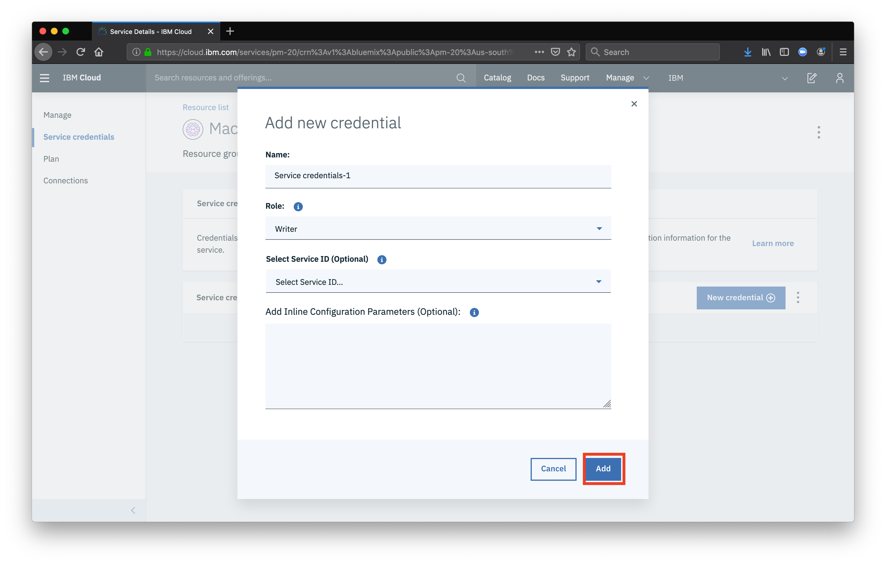
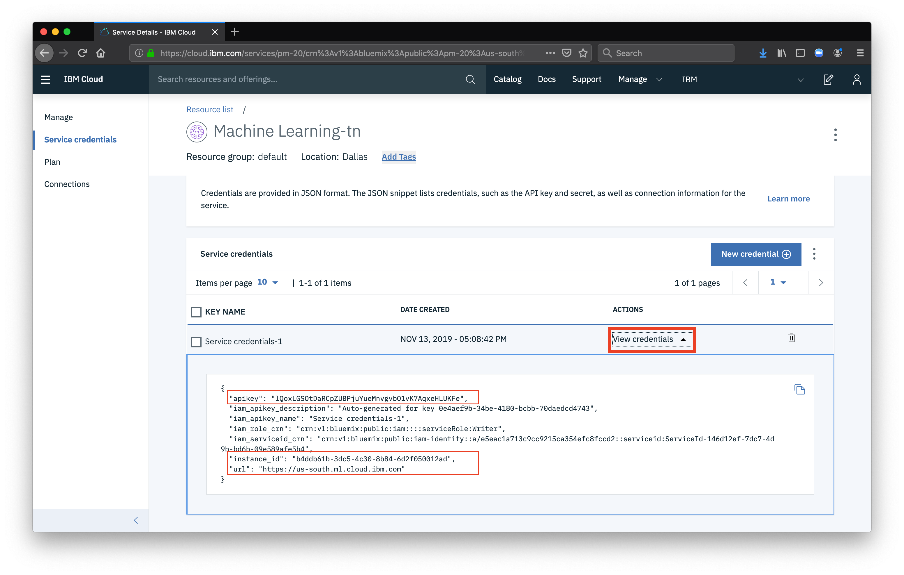

Now that your model is built, lets use Watson Machine Learning to make the model usable in an application. 

##  Setup Watson Machine Learning
Navigate to [cloud.ibm.com](https://cloud.ibm.com/) and click **Create Resource**

In the search bar, search for `watson machine learning` and click the icon

Select the **Lite** plan and click **Create**

Once the service has been created, click **Service Credentials**

Click the button for **New Credential**

Click **Add**

Click **View credentials** and copy the pieces needed in the notbook

Once you have added the credentials, you can run the whole notebook again, this time deploying and testing the model. 

In the project, you will now see a deployed model listed as an asset. Now that the model is deployed, you can share the scoring URL, and use your model in any application you'd like. In addition, you can retrain the model, redeploy as a new version, and have utilize continuous deployment to constantly improve your model.