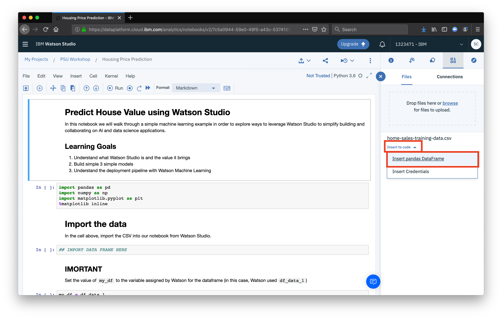

The notebook provided is a boilerplate to get going with this workshop. For starters, we've included  the methods to import the data, clean the data, and build 3 different models using the Scikit-learn library. 

## Import the data
The first task in the notebook is to import our CSV file as a pandas dataframe. To do this, click the **find and add data** button, a sidebar will open

Next, select the cell with the comment `IMPORT DATA FRAME HERE`

Now, in the sidebar that opened, select our CSV data source, select the dropdown to **Insert to code** and select the option **Insert pandas DataFrame**

You should see the generated code appear. You can close the sidebar using the **X** button. 

The last thing we need to do is a housekeeping step.

When Watson Studio generates the code to import our CSV as a dataframe, is generates a variable name to assign the DataFrame to, in the form of `df_data_X`, in the cell beloow our import code, rename the variable with your own. 
(For example, in our case `my_df = df_data_X` would be changed to `my_df = df_data_2`)

## Run the noteboook
Now that you've made these changes, it's time to run! One of the benefits of using a notebook, is that instead of having to run your entire program at once, you can run each cell individually. This allows you to debug more effeciently, seeing where errors arise, but also gives you the ability to quickly test things out. In order to run the notebook, select the cell at the top of the notebook, and run by using the key-combo `shift`+`enter` this will run one cell and then move your cursor to the next cell. If you'd rather run the whole document at once, click the **Cell** menu at the top, and select **Run All**.